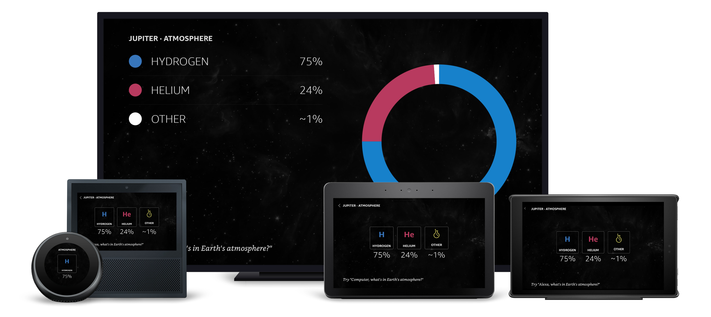

# Atmosphere View

## Overview

Shown when the user requests information about a planet's atmosphere. Using periodic-table-esque graphics to represent atmospheric elements and text to describe actual percentages. The layout changes drastically on larger screens.

### Updates

Staggered animations were added that use the document's `onMount` field to trigger when the page loads. The PNGs used in the TV views were replaced with Alexa Vector Graphics.

### Layout Notes

New layouts were created for the element tiles on hubs, using `Frames`, `Text` and `Images` to achieve the design. Text is styled using the alexa-styles package.

## Layout

- [/lambda/custom/documents/atmosphere.js](../lambda/custom/documents/atmosphere.js)

## External Packages Used

- alexa-styles
- alexa-layouts

## Components Used

- Container
- Frame
- Text
- Image
- Sequence
- alexa-layouts:AlexaHeader
- alexa-layouts:AlexaFooter

## Variations

### **Extra Large TV**

Because of the larger screen size, the layout is completely changed, using a vertical list to display the element names and proportions. Each list item consists of a Frame for the color and Text for the name and percentage. The donut graph is now an AVG served from a custom graphics package, [atmosphere-graphics.json](../packages/atmosphere-graphics.json).

### **Small Hubs**

To maintain readability, each element has been moved to its own page in a Pager.
