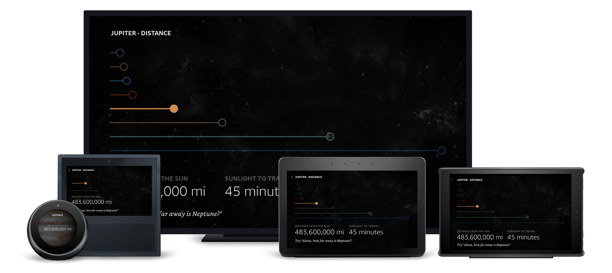

# Distance View

## Overview

This is a comparison view for distance. Graphics represent a planet's distance from the sun, relative to the farthest planet. Graphics are highlighted when they correspond with the planet(s) in question.

### Updates

Stagger animations were added to the document's `onMount` field and the distance graphics were animated to scale in at a constant rate, relative to their distance from the sun.

### Layout Notes

- Distance graphics are created using Containers, Frames and TouchWrappers that are sized according to distance data.
- Within the footer, a `textToHint` transform is used to create a Hint, which adds the user-defined wake word to a provided string. This is then supplied to the `AlexaFooter`'s `footerHint`\* _property_.\*

## Layout

- [/lambda/custom/documents/distance.js](../lambda/custom/documents/distance.js)

## External Packages Used

- alexa-styles
- alexa-layouts

## Components Used

- Container
- Frame
- TouchWrapper
- Image
- Text
- alexa-layouts:AlexaHeader
- alexa-layouts:AlexaFooter

## Variations

### **Extra Large TV/Large Hubs**

The Layouts are the same for these devices, with Text callouts positioned at the bottom. The callout on the right is only shown when the distance is relative to the sun and not another planet.

### **Medium and Small Hubs**

Vertical height limits the number of planet graphics that can fit on screen, so it is constrained to three at a time.

### **Small Round Hubs**

The screen size prevents effective imagery, so the layout is altered to show only the relevant information.
