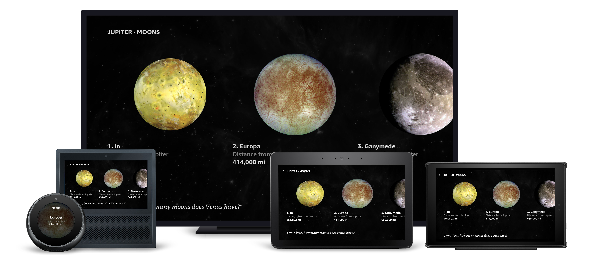

# Horizontal Image List View

## Overview

This is an image-forward list that includes ordinals. The ordinals allow for easy voice navigation. TouchWrappers surround each item for easy touch-forward navigation. Text sizing is handled by the _alexa-styles_ package to ensure proper sizing for legibility across multiple viewing distances and screen sizes. The view also uses the AlexaHeader and AlexaFooter provided by the alexa-layouts package.

### Layout Notes

- Used By:
  - Inner/Outer Planets
  - Moons
- Within the footer, a `textToHint` transform is used to create a Hint, which adds the user-defined wake word to a provided string. This is then supplied to the `AlexaFooter`'s `footerHint`\* _property_.\*

## Layout

- /packages/layouts.json
  - [ZoneList](../packages/layouts.json#L555)
  - [MoonList](../packages/layouts.json#L788)

## **External Packages Used**

- alexa-layouts
- alexa-styles

## **Components Used**

- Container
- Image
- TouchWrapper
- Text
- Pager
- alexa-layouts:AlexaHeader
- alexa-layouts:AlexaFooter

## Variations

### **Extra Large TV**

Focus states allow users to visually identify targets. Pressed states provide feedback

### **Medium and Large Hubs**

Pressed states provide feedback for interactions.

### **Small Round Hubs**

The horizontal list is converted to a Pager with full-screen TouchWrappers and images. This is the same pattern used by the solar system view.
