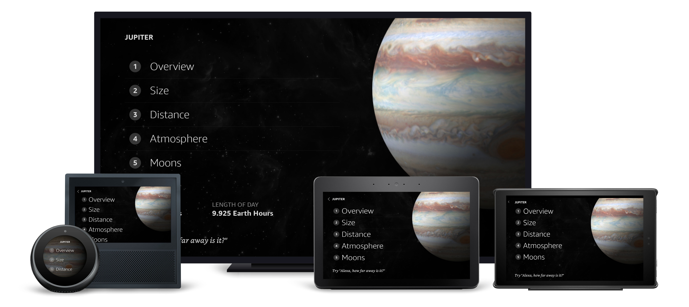

# Planet Details View

## Overview

Each time a user navigates to a planet, we display a Planet Details view that guides the user to a short list of supported detail types. The purpose of this is two-fold; while you can design experiences to be more open-ended, we purposefully defined Overview, Size, Distance, Atmosphere, and Moons so we could show what a framed experience looks like and to inform the user what they can ask readily. Each page consists of a vertical list of `TouchWrappers` with ordinals, `Images` and some conditional `Text` callouts. `Text` components make use of the text styles found in the alexa-styles package to properly size, color and weight the text for optimal visibility across devices.

### Updates

Staggered animations were added that use the document's `onMount` field to trigger when the page loads.

### Layout Notes

Within the footer, a `textToHint` transform is used to create a Hint, which adds the user-defined wake word to a provided string.

## Layout

- /packages/layouts.json
  - [PlanetDetailsList](../packages/layouts.json#L707)

## External Packages Used

- alexa-styles
- alexa-layouts

## Components Used

- Container
- Sequence
- TouchWrapper
- Text
- Image
- Frame
- alexa-layouts:AlexaHeader
- alexa-layouts:AlexaFooter

## Variations

### **Extra Large TV**

Focus states on the vertical list items allow users to visually identify targets. Because of the larger screen size, 'when' clauses are used to show additional text callouts.

### **Medium and Large Hubs**

Layout is identical to FireTV, minus the text callouts which do not fit within the smaller screen sizes.

### **Small Round Hubs**

The left-aligned list and right-aligned image are centered, while a full-screen scrim increases legibility against the bright background imagery.

### **Small Landscape Hubs**

To save on vertical real estate, the footer was removed and the list allowed to scroll.
