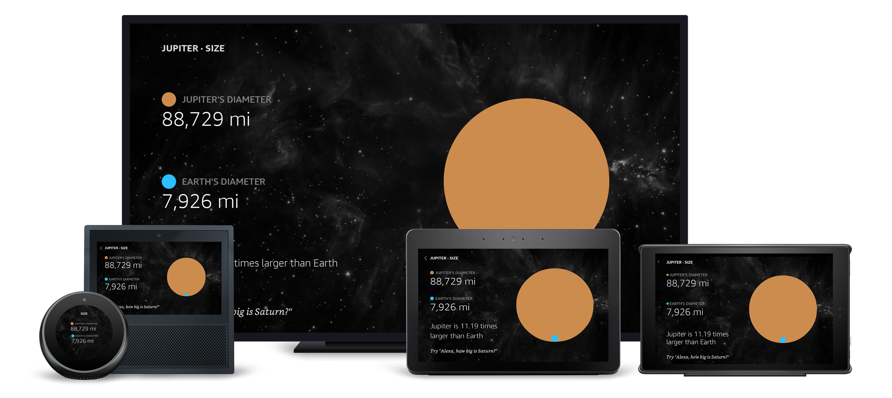

# Size View Readme

## Overview

This is a comparison view for planet size. `Text` callouts feature relevant information, while `Frames` create graphical representations of size differences.

### Layout Notes

- The size comparison graphic is created using `Frames` and programmatically determined zIndex and relative sizes.
- Within the footer, a `textToHint` transform is used to create a Hint, which adds the user-defined wake word to a provided string. This is then supplied to the `AlexaFooter`'s `footerHint`\* _property_.\*

## Layout

- [/lambda/custom/documents/size.js](../lambda/custom/documents/size.js)

## External Packages Used

- alexa-layouts
- alexa-styles

## Components Used

- Text
- Frame
- Image
- Container
- Pager
- alexa-layouts:AlexaHeader
- alexa-layouts:AlexaFooter

## Variations

### **Extra Large TV/Medium and Large Hubs**

The layout is the same for these devices, with the exception of medium hub dropping some text for size issues.

### **Small Hubs**

The layout is converted to a `Pager`, with callout information on one page and programmatically generated `Frames` on the other.
