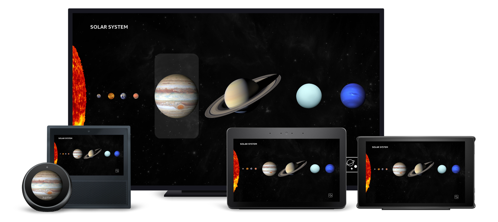

# Solar System View

## Overview

When the skill opens, following the splash screen, the Solar System view is presented showcasing the sun, the 8 planets, and an Image Button for the Space Image of the Day. This view highlights the two paths they can take, either exploring the celestial bodies or viewing a randomized space image. This view uses Images to render each of the planets. Each planet is wrapped with a Touch Wrapper to support touch and Fire TV remote control navigation in addition to voice.

This view uses Images to render each of the planets. Each planet is wrapped with a Touch Wrapper to support touch and Fire TV remote control navigation in addition to voice.

### Updates

Staggered animations were added that uses the document's `onMount` field to trigger when the page loads.

### Layout Notes

- Within the footer, a `textToHint` transform is used to create a Hint, which adds the user-defined wake word to a provided string. This is then supplied to the `AlexaFooter`'s `footerHint`\* _property_.\*

## **Layout**

- /packages/layouts.json
  - [SolarSystem](../packages/layouts.json#L318)
  - [SolarSystemSmallRoundHub](../packages/layouts.json#L491)

## **External Packages Used**

- alexa-layouts
- alexa-styles

## **Components Used**

- Container
- Image
- TouchWrapper
- Text
- Pager
- alexa-layouts:AlexaHeader
- alexa-layouts:AlexaFooter

## Variations

### **Extra Large TV**

On Fire TV devices, the `TouchWrappers` allow for navigation using the remote control, with focus highlighting to indicate location. They also include a pressed state to provide visual feedback for interactions.

### **Medium and Large Hubs**

On our Hub Devices, the layout remains the same as the Fire TV, but we conditionally add additional `TouchWrappers` to account for small targets that allow the user to navigate to a supplimentary view for easier planet selection. Pressed states provide user feedback for interactions.

### **Small Round Hubs**

The layout is drastically altered to accommodate the smaller screen, converting the solar system to a `Pager`, with individual, full-screen `TouchWrappers` containing Images for each planet. Pressed states are still present for interactions. There is a subtle gradient scrim on the bottom of the image to increase legibility of the text while maintaining the vibrancy of the imagery.
