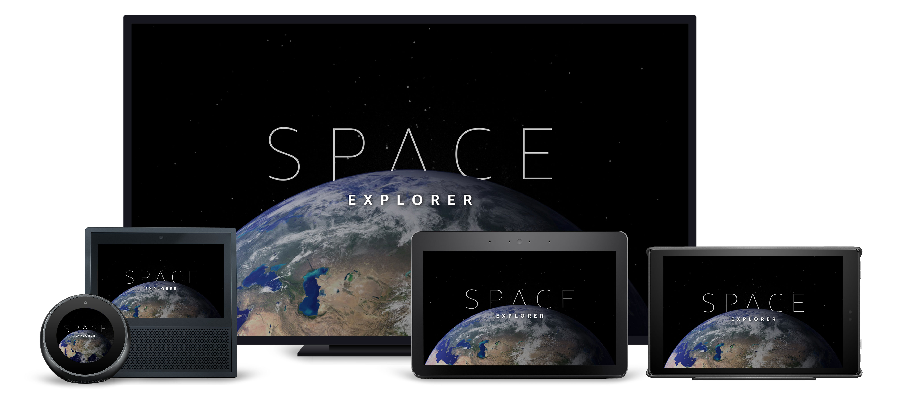

# Splash Screen View

## Overview

The splash screen is displayed when first opening the skill. It is intended to mask the loading of the solar system images. With the release of APL 1.1, we were able to implement a solution that uses the video ending to trigger an opacity transition that reveals the solar system.

### Layout Notes

- See [Solar System View](https://quip-amazon.com/gdEpAcbg3pCA) for additional details.

## Layout

- [/lambda/custom/documents/landing.js](../lambda/custom/documents/landing.js)

## Packages Used

None.

## Components Used

- Frame
- Image
- Video

## Variations

None.
