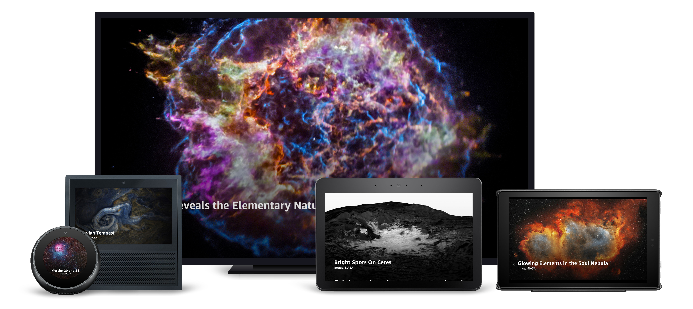

# Transcript View

## Overview

This is a full-screen image behind a title and source attributions, with text peeking at the bottom of the page to indicate users can scroll for more content. When this page is navigated to via voice (with the exception of Astronomy Images), the text is automatically scrolled into view, while Alexa speaks the content. While speaking, the corresponding line is highlighted. When Alexa has completed speaking, the text is scrolled back to the bottom of the page. Notice that when the page is scrolled a slight scrim appears over the image to increase legibility. With Astronomy Images, users say,_ “Alexa, tell me about it,”_ to start the synchronized speech. Text is styled using the alexa-styles package.

### Layout Notes

**Used By:**

- Astronomy Images (no Header, no auto speech)
- Planet Overview
- Interesting Facts (i.e. _“Alexa, what happened to Pluto?”_)

## Layout

- [/lambda/custom/documents/transcript.js](../lambda/custom/documents/transcript.js)

## External Packages Used

- alexa-styles
- alexa-layouts

## Components Used

- Container
- Image
- ScrollView
- Text
  - SpeakItem directive
- alexa-layouts:AlexaHeader

## Variations

### Small Round Hub

The title and source attribution are centered.
